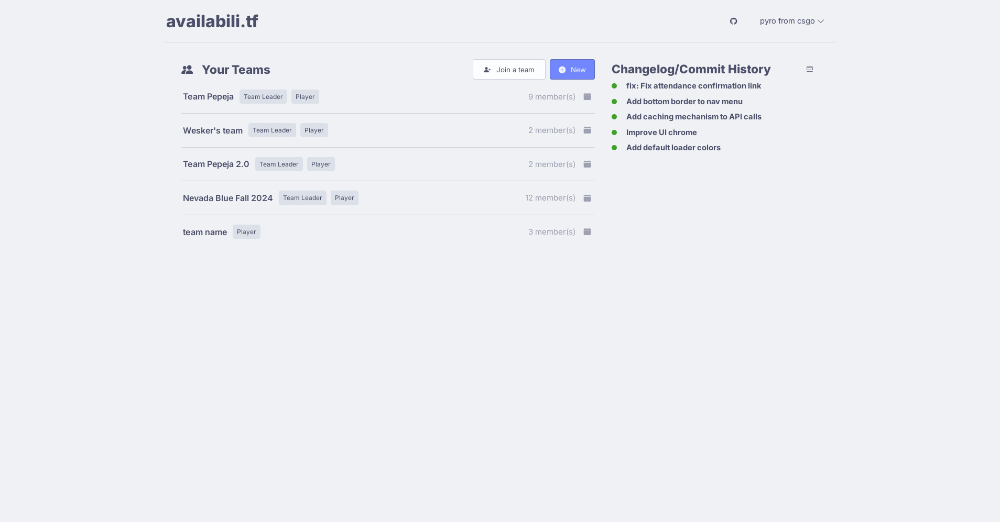
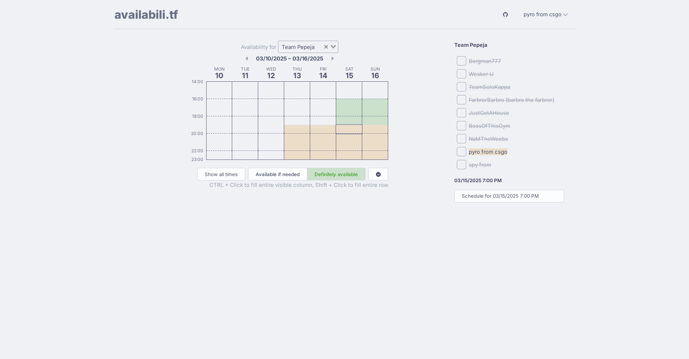
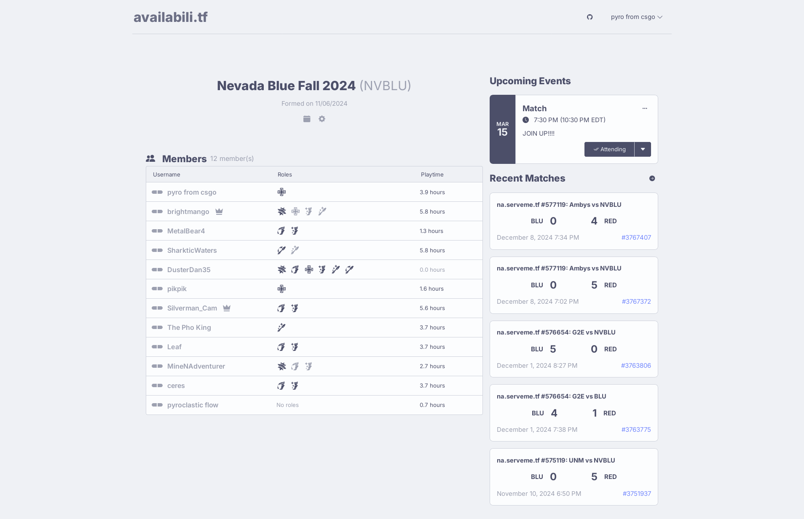
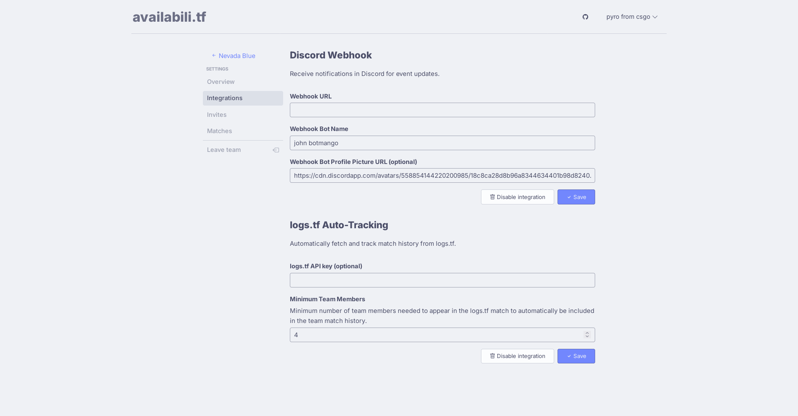

# availabili.tf

Schedule and availability system for Team Fortress 2 teams.

## Tech Stack

- **Frontend:** [Vue 3](https://v3.vuejs.org/) + TypeScript
    - **State Management:** [Pinia](https://pinia.vuejs.org/)
- **Backend:** [Flask](https://flask.palletsprojects.com/) + Python
    - **ORM:** [SQLAlchemy](https://www.sqlalchemy.org/)
    - **Validation:** [Pydantic](https://pydantic-docs.helpmanual.io/)
    - [spectree](https://spectree.readthedocs.io/en/latest/index.html) for
      OpenAPI documentation
    - [Flask-Migrate](https://flask-migrate.readthedocs.io/en/latest/)
      (Alembic) for database migrations
    - [Celery](https://docs.celeryproject.org/en/stable/) for async and
      scheduled tasks
    - [Redis](https://redis.io/) for Celery broker
- **Database:** [PostgreSQL 17.1](https://www.postgresql.org/docs/17/index.html)
  (production) / SQLite (development)

## File Structure

```
availabili.tf/               root
├── availabili.tf/           frontend (Vue.js)
├── backend-flask/           backend/software layer (Python)
├── nginx/                   reverse proxy
├── docker-compose.prod.yml  production environment
├── docker-compose.yml       development environment
└── README.md                this file
```

## Setup (production, Postgres)

Build the frontend app, assuming Node.js is installed:

```sh
cd availabili.tf
npm install
npm run build
cd ..
```

Build the rest of the containers:

```sh
docker compose -f docker-compose.prod.yml build
docker compose -f docker-compose.prod.yml up db backend
```

Perform initial database migration. This is for automatically setting up the
database schema for the first time:

```sh
docker exec -it backend-production bash
flask db upgrade
exit
```

Bring up the rest of the containers:

```sh
docker compose -f docker-compose.prod.yml up
```

The app will run at port 8000 and the database will be available at port 5432.

## Setup (development, SQLite3)

Build the frontend app:

```sh
cd availabili.tf
npm install
npm run build
```

Build the rest of the containers and perform initial database migration:

```sh
docker compose build
docker compose up
DATABASE_URI=sqlite:///db.sqlite3 flask db upgrade
```

The app will run at port 8000.

## OpenAPI

The backend will automatically serve its OpenAPI-compliant spec at
`/apidoc/openapi.json` which can also be viewed at `/apidoc/redoc` or
`/apidoc/swagger` or `/apidoc/scalar`.

To regenerate the frontend client during development:

```sh
npm run openapi-generate
```

## CS 333 Project

Test coverage is 81% with several unit tests and 5 integration tests. Tests are
located in `backend-flask/tests` GitHub Actions are used to run the tests on
every push to the master branch. If the tests fail or the test coverage drops
below 75%, the workflow will fail. If the workflow succeeds, a docker will be
built and pushed into the GitHub container registry. The docker image will be
tagged with the latest tag. A Komodo deployment will automatically be triggered
to deploy the new image to the environment.

## Screenshots

### Home



### Schedule



### Team



### Team Settings


